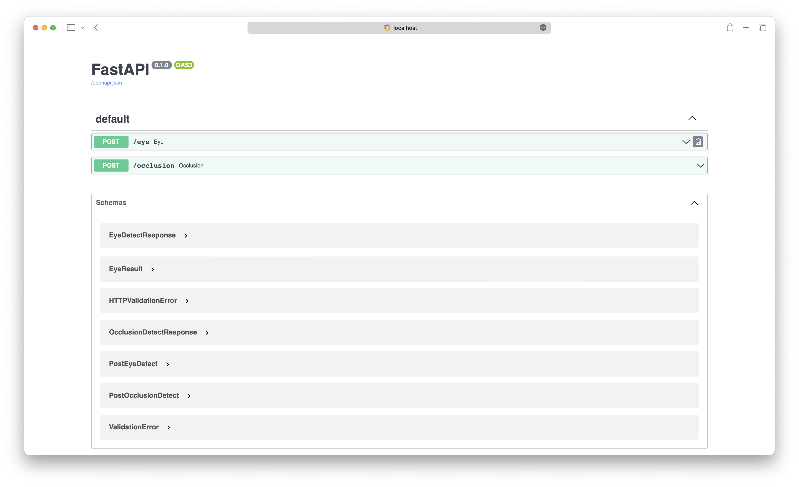
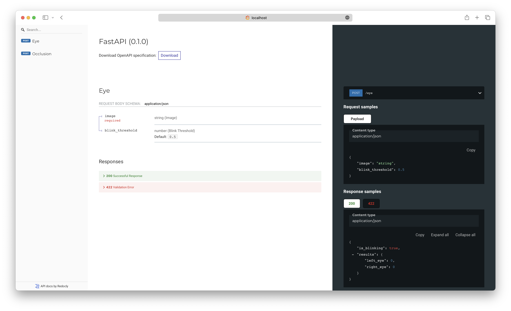
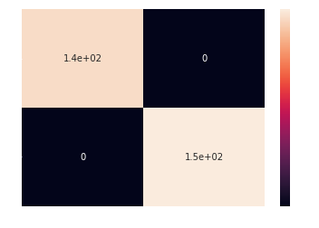
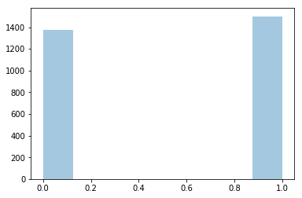
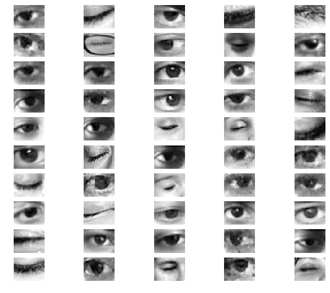
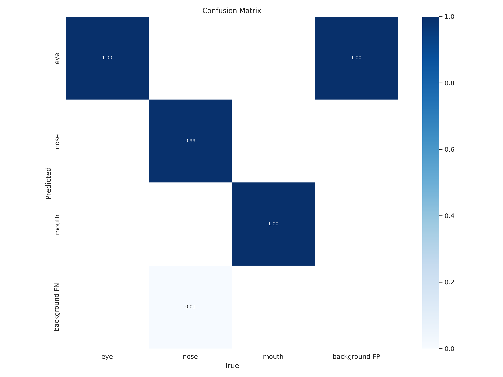
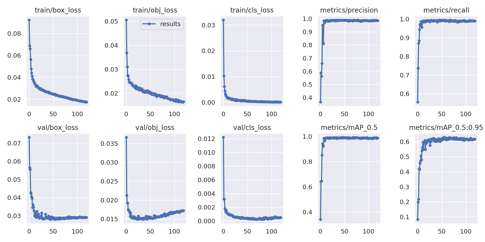
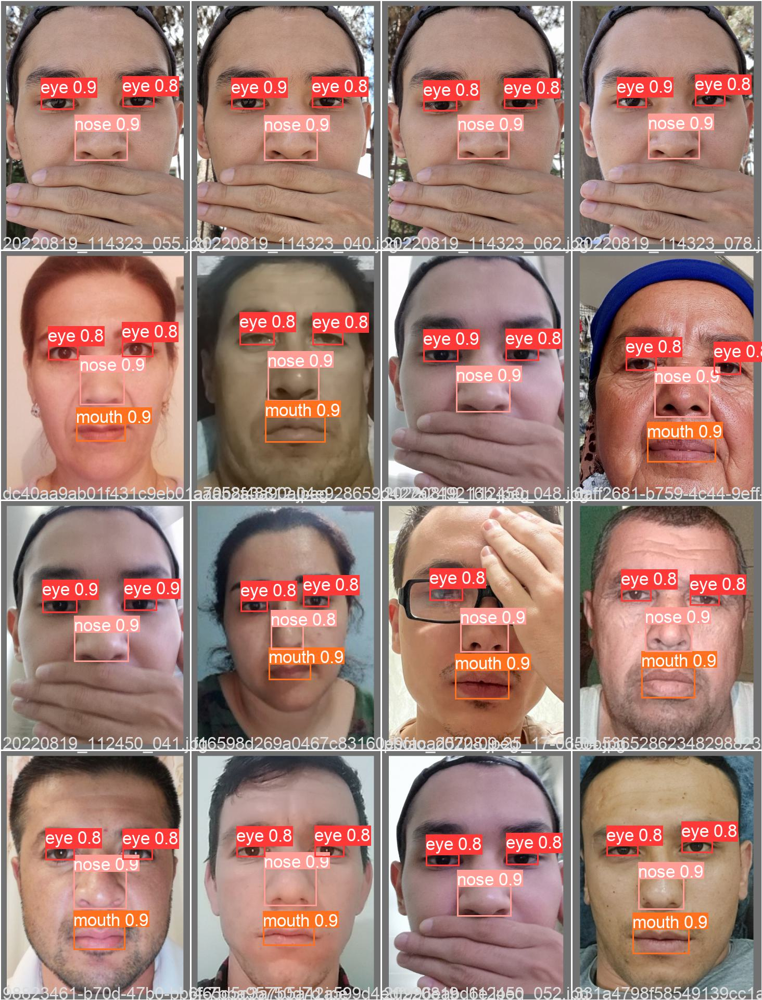

Eye and Occlusion detection for liveness detection
=====
<!--- These are examples. See https://shields.io for others or to customize this set of shields. You might want to include dependencies, project status and licence info here --->


[F22] Introduction to `Computer Vision` Final Exam at `Innopolis university`

### Prerequisites

Before you begin, ensure you have met the following requirements:

* You have installed the latest version of `Python`
* You have a `Windows/Linux/Mac` machine.
* You have read `README.md`.

### Installing requirements and running

_If you have docker on your machine then you can skip to the next section._
To install requirements, follow these steps:

```shell
conda create -n cv python=3.9 -y && conda activate cv
pip install -r requirements.txt
uvicorn main:app --reload
```

### Using Docker

To use Docker, follow these steps:

```shell
docker build -t cv .
docker run -it --rm cv -p 80:3000
```

or

```shell
docker-compose up -d --build
docker-compose logs # to see logs
```

### Convert Keras model to ONNX

```shell
python -m tf2onnx.convert --keras <input model>.h5  --output  <output model>.onnx
```

## Documentation

After running the server, you can access the documentation at `http://localhost:3000/docs`
or `http://localhost:3000/redoc`

### Interactive API documentation



### Alternative documentation



# Eye detection

First of all, there will be face detection process through onnx mtcnn, then the eyes will be detected through the face
landmarks. The eyes will be cropped and resized to 34x26. Then the model will predict the eyes and the result will be
returned.

```python
class Detector:
    def __init__(self):
        self.mtcnn = MTCNN()
        ...
```

For a better introduction to the code, check out the [detection.py](detection.py) file.

To detect the eyes from the detected face it is necessary to find the points on the face, for this I used
the[ dlib 68 landmark model](eye_detector/models/shape_predictor_68_face_landmarks.dat)

```python
# get the landmarks/parts for the face
shapes = predictor(gray, dlib.rectangle(*bbox))
shapes = face_utils.shape_to_np(shapes)

# get the left eye points
eye_img_l, _ = crop_eye(gray, eye_points=shapes[36:42])
eye_img_r, _ = crop_eye(gray, eye_points=shapes[42:48])
```

For a better introduction to the code, check out the [utils.py](eye_detector/utils.py) file.

To predict the eyes, I used a custom model trained with [own dataset](eye_detector/datasets/dataset.csv)

**Confusion matrix:**



**Classification report:**



**Results:**



# Occlusion detection

For occlusion detection, I used the [YOLOv5](https://github.com/ultralytics/yolov5) model.

**Confusion matrix for the model:**


**results:**


**Results after training the model for 120 epoch:**


RS_REAL.yaml for training the model:

```yaml
names: [ 'eye', 'nose', 'mouth' ]
```

- For more results check out the [assets/occlusion_metrics](assets/occlusion_metrics) folder.

# Authors

* [@YoshlikMedia](https://github.com/yoshlikmedia)
* [@ParthKalkar](https://github.com/parthkalkar) 